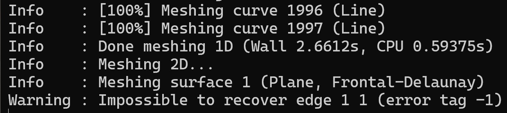

# SpiderFEA v0.1.1 Bug Fix Evaluation

**Date:** 2026-05-29  
**Version:** 0.1.1  
**Status:** ISSUE NOT RESOLVED — Action Required

---

## 1. Problem Statement

Gmsh hangs during 2D Frontal-Delaunay meshing with:

```
Warning : Impossible to recover edge 1 1 (error tag -1)
```

The mesh worker thread never completes.



---

## 2. Root Cause

**Normal thickness offset on tight corrugation curvature produces self-intersecting polygons.**

The spider geometry uses sinusoidal corrugation:
- Amplitude `h` = 7–10 mm (half-amplitude 3.5–5 mm)
- 7 peaks over ~17.5 mm radial span
- Thickness `t = 0.75 mm` → half-thickness offset = 0.375 mm

Local radius of curvature at corrugation peaks:

```
R_curve ≈ L² / (A · π² · n_peaks²)
R_curve ≈ 17.5² / (5 · π² · 49) ≈ 0.127 mm
```

Since `half_t (0.375 mm) > R_curve (0.127 mm)`, the normal offset surfaces cross at the peaks. **This is expected physics for a stamped corrugated membrane.** The offset method is correct; the geometry parameters in this case produce an invalid polygon.

**Evidence:**

```
Normal offset:  total points=1996, self-intersections=9
Z-offset only:  total points=1996, self-intersections=0
```

---

## 3. Why v0.1.1 Failed

| Fix Attempt | What Was Done | Why It Didn't Work |
|------------|---------------|-------------------|
| Duplicate closing point | Removed `profile_r.append(profile_r[0])` | Red herring — not the root cause |
| Consecutive deduplication | Added dedup before Gmsh | Self-intersections are not duplicate points |
| `gmsh.finalize()` in `finally` | Wrapped in `try/finally` | Gmsh hangs; `finally` runs only after `generate()` returns |
| `QThread` worker | Moved meshing off UI thread | UI no longer freezes, but mesh never completes |

**The test suite had a false positive:** `test_real_mesh_generation_completes` used `[::20]` downsampling (~2000 → ~100 points), which smoothed away the self-intersection. The test passed on sanitized geometry, not production geometry.

---

## 4. Required Fixes

### 4.1 Pre-Flight Geometry Check (Predictive)

Before calling `recalculate_profile()`, detect parameter combinations that **will** produce self-intersection.

**Implementation:**

```python
def check_spider_geometry_valid(design: SpiderDesign) -> tuple[bool, str]:
    """
    Returns (True, "") if geometry is expected to produce a simple polygon.
    Returns (False, reason) if parameters will cause self-intersection.
    """
    # Approximate minimum radius of curvature in corrugation region
    L = design.corr_width  # ~17.5 mm typical
    A = design.corr_amp    # half-amplitude, 3.5–5 mm
    n = design.corr_peaks  # 7 typical
    half_t = design.thickness / 2.0

    R_curve_min = (L ** 2) / (A * math.pi ** 2 * n ** 2)

    if half_t >= R_curve_min:
        return False, (
            f"Thickness offset ({half_t:.3f} mm) exceeds minimum corrugation "
            f"radius of curvature ({R_curve_min:.3f} mm). "
            f"Reduce thickness, reduce amplitude, or increase peak count."
        )
    return True, ""
```

**Call site:** In `_on_generate_mesh()` and in `validate_geometry()`:

```python
valid, msg = check_spider_geometry_valid(self.design)
if not valid:
    QMessageBox.warning(self, "Invalid Spider Geometry", msg)
    return
```

**Bounds for GO/NO-GO:**
- If `half_t / R_curve_min >= 1.0` → **NO-GO** (will self-intersect)
- If `half_t / R_curve_min < 0.5` → **GO** (comfortable margin)
- If `0.5 <= half_t / R_curve_min < 1.0` → **WARNING** (marginal, may still work depending on exact profile)

### 4.2 Post-Generation Polygon Validation (Reactive)

After `recalculate_profile()`, verify the polygon is simple before handing it to Gmsh.

**Implementation:**

```python
def is_simple_polygon(r: list[float], z: list[float]) -> tuple[bool, int]:
    """
    Returns (True, 0) if polygon has no self-intersections.
    Returns (False, N) if N self-intersections detected.
    Uses shapely if available; falls back to segment-pair O(n²) check.
    """
    ...
```

**Call site:** In `generate_mesh()`, before `gmsh.initialize()`:

```python
is_simple, n_x = is_simple_polygon(design.profile_r, design.profile_z)
if not is_simple:
    raise ValueError(
        f"Generated spider profile has {n_x} self-intersection(s). "
        f"Adjust geometry parameters to increase corrugation radius of curvature."
    )
```

**Decision rule:** If `n_x > 0`, abort before Gmsh. Do not attempt repair. The user must change geometry.

### 4.3 Gmsh Hang Safety Net

Gmsh's `generate(2)` can hang on valid-looking input too (bad mesh size, sliver elements). Add a timeout wrapper.

**Implementation:**

```python
import multiprocessing

def _generate_mesh_worker():
    gmsh.model.mesh.generate(2)

def generate_mesh_with_timeout(design, timeout_sec=30):
    ...
    process = multiprocessing.Process(target=_generate_mesh_worker)
    process.start()
    process.join(timeout=timeout_sec)
    if process.is_alive():
        process.terminate()
        process.join()
        raise TimeoutError(f"Gmsh mesh generation exceeded {timeout_sec}s")
    ...
```

**Decision rule:** Timeout = 30s for typical spider meshes. If it times out, report "Mesh generation timed out — try coarser mesh or check geometry validity."

### 4.4 Fix the Integration Test

Remove `[::20]` downsampling. The test must exercise production geometry.

```python
def test_real_mesh_generation_completes():
    # DO NOT downsample. Use exact profile from recalculate_profile().
    design = SpiderDesign()  # default parameters
    design.recalculate_profile()
    
    # Pre-flight check must pass
    valid, msg = check_spider_geometry_valid(design)
    assert valid, msg
    
    # Polygon must be simple
    is_simple, n_x = is_simple_polygon(design.profile_r, design.profile_z)
    assert is_simple, f"Self-intersections: {n_x}"
    
    # Mesh must complete within timeout
    mesh_path = generate_mesh_with_timeout(design, timeout_sec=30)
    assert mesh_path.exists()
    assert mesh_path.stat().st_size > 0
```

**Decision rule:** If this test passes, the geometry → mesh pipeline works for default parameters. If it fails, the bug is real and must be fixed before release.

---

## 5. Implementation Order

1. **Add `check_spider_geometry_valid()`** — blocks bad parameters at UI level
2. **Add `is_simple_polygon()`** — catches any geometry that slips through
3. **Add `generate_mesh_with_timeout()`** — safety net for all Gmsh calls
4. **Fix `test_real_mesh_generation_completes()`** — remove `[::20]`, add validity asserts
5. **Wire `_on_generate_mesh()`** — call pre-flight check before starting worker
6. **Run test suite** — verify no regressions, verify hang is caught

**Do not over-analyze. These are four concrete functions and one test fix.**

---

## 6. Verification Criteria

| Check | Pass Criteria |
|-------|--------------|
| Pre-flight with bad params | `check_spider_geometry_valid()` returns `(False, ...)` for `t=0.75, h=10, peaks=7` |
| Pre-flight with good params | Returns `(True, "")` for `t=0.3, h=5, peaks=7` |
| Polygon validity | `is_simple_polygon()` detects 0 intersections for good params, >0 for bad |
| Gmsh timeout | `generate_mesh_with_timeout()` raises `TimeoutError` if Gmsh hangs >30s |
| Integration test | `test_real_mesh_generation_completes()` passes with full-resolution profile |
| UI behavior | Clicking "Generate Mesh" with bad params shows warning dialog; no hang |

---

## 7. What NOT to Do

- **Do not** change normal offset to z-only offset. Normal offset is correct for stamped corrugated membranes.
- **Do not** add automatic geometry repair (coarsening, smoothing, etc.). If the user's parameters are invalid, tell them. Do not silently change their design.
- **Do not** write a generic "solver pre-flight" skill. The curvature check is SpiderFEA-specific. A generic skill would be over-engineering at this stage.
- **Do not** expand this into a multi-agent workflow analysis. The fix is four functions. Implement them.
